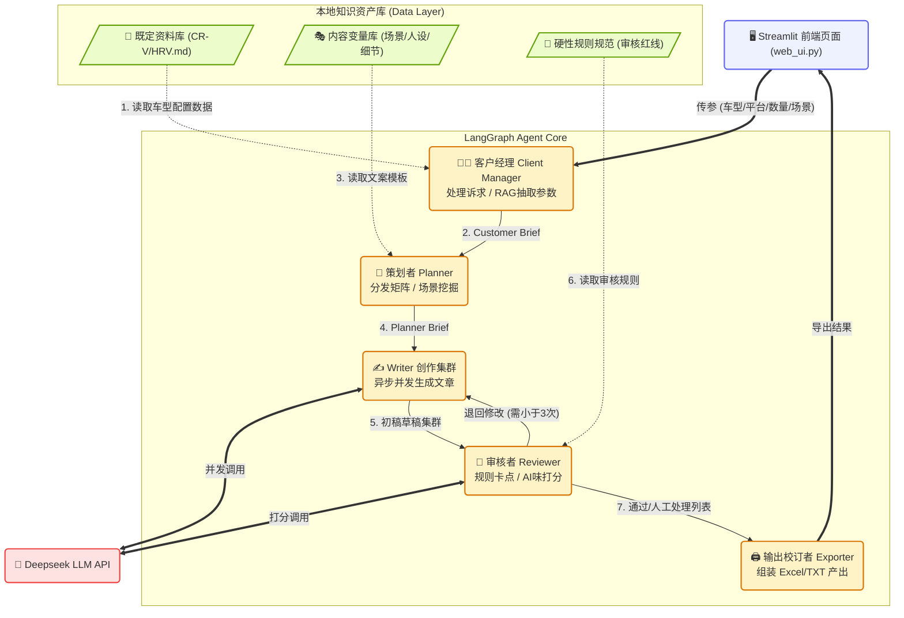

# Agent Swarm 项目架构与 Bug 检测指北
**创建时间**: 2026-02-11
**遵循规范**: Planning with Files (基于文件沉淀的项目规划与一致性追踪)

---

## 1. 当前系统架构图 (System Architecture)

---

## 2. 避免“屎山代码”的 4 个核心防区与 Bug 点

根据当前代码架构的巡天图，目前项目潜藏着以下几个会演变为屎山（难以维护）的 Bug/雷点需要调整：

### 🚨 Bug 点 1：配置与业务逻辑高度耦合 (硬编码问题)
- **现状表现**：`swarm_with_llm.py` 中，`DEEPSEEK_API_KEY`、`字数限制范围`、`不同文件的路径常量` 全部写死在各个函数的内部。
- **屎山预警**：一旦未来换模型（比如换成 Claude 4），或者资料库文件夹换个名字，我们需要在长达 1200+ 行的代码里到处找地方修改，极其容易漏改。
- **调整建议**：应当创建一个全局的 `config.yaml` 或 `.env`，让 API 密钥和平台字数枚举等动态参数统一抽离管理。让代码只关心处理逻辑。

### 🚨 Bug 点 2：并发模式下的高频文件 I/O (阻塞雷区)
- **现状表现**：使用 `load_material` 这种同步的文件读取函数。但在 Writer 进行 `asyncio.gather(*tasks)` 异步并发请求 API 时，每个独立任务可能都会去触发读取本地 MD 资料库。
- **屎山预警**：当前篇数是 3-5 篇，可能感受不明显。但是当批量生成达到 50 篇（并发度升高）时，频繁打开关闭同一文件的同步操作可能跑满系统 IO，引起阻塞卡死。
- **调整建议**：文件加载机制需要实现**单例模式 (Singleton/缓存)**。例如，在 Agent 初始化时统一将常用的各种规则文件加载到内存字典中缓存，之后的全部并发读取皆从内存走，不再多次读盘。

### 🚨 Bug 点 3：API 无异常保护断路器
- **现状表现**：`create_single_content` 在并发调用 LLM 时，只有最基础的 Try-Catch，但缺乏“降级重试”（Retry）机制和并发信号量（Semaphore）限制。
- **屎山预警**：如果你未来一次性推演 20 个段落，大量并发砸向 Deepseek API 非常容易遇到 `HTTP 429 Too Many Requests`。而目前缺少单点重试补偿机制，这会导致如果有一篇 API 超时报错，它就返回了一个带乱码的 Error 字典进入后续审核节点，让整个图状态被污染。
- **调整建议**：对底层的异步 API 请求增加 `tenacity` 库做重试机制，或者利用 `asyncio.Semaphore(5)` 将最大同时请求量控制在 5~10 并发，保护链路稳健运转。

### 🚨 Bug 点 4：场景推理未形成真正的映射 (伪动态)
- **现状表现**：我们在 `web_ui.py` 中虽然让用户可以自由输入了“过年回家满载而归”，但下游本质上还是直接拼接字符串传递给 Writer，并没有**真正去提取和匹配**《内容变量库》里面的优秀句式和情感升华模版。
- **屎山预警**：这种粗暴拼装，会让策划者长期处于“传话筒”的作用，而无法展现统筹规划的智力。久而久之会导致大家一直以为存在智能分配系统，结果全是模型在硬生生闭门造车。
- **调整建议**：策划者 (Planner) 需要接入 RAG。遇到非常规文本场景时，先用 LLM 根据用户输入，从库中匹配最相似的基础范式，再行揉捏成具体的 assignment 任务派发给 Writer。
