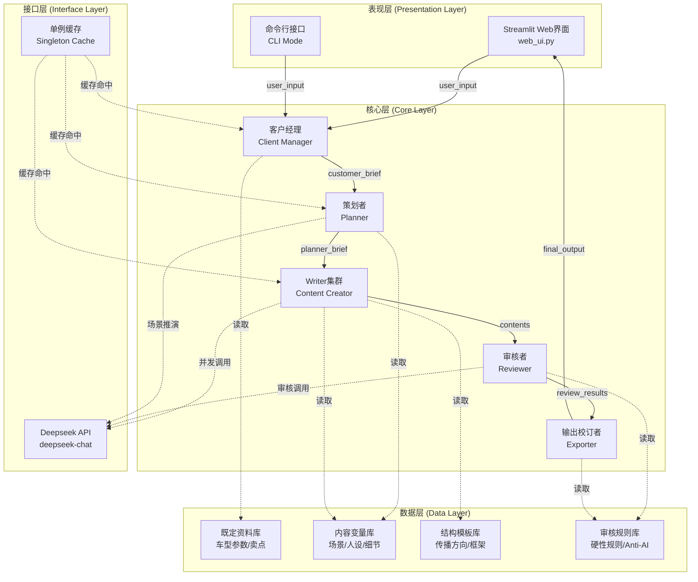
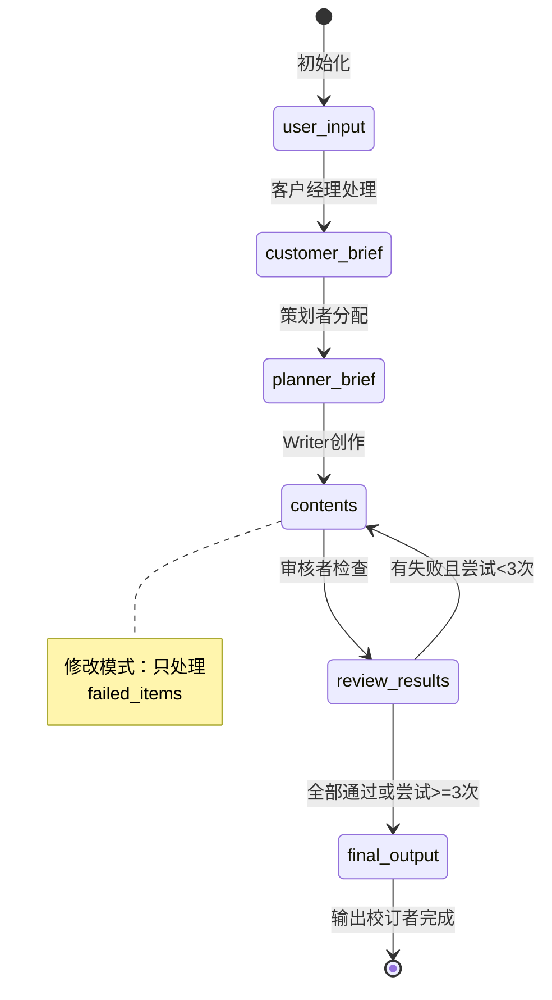
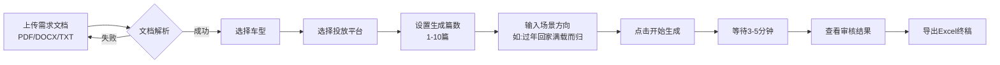
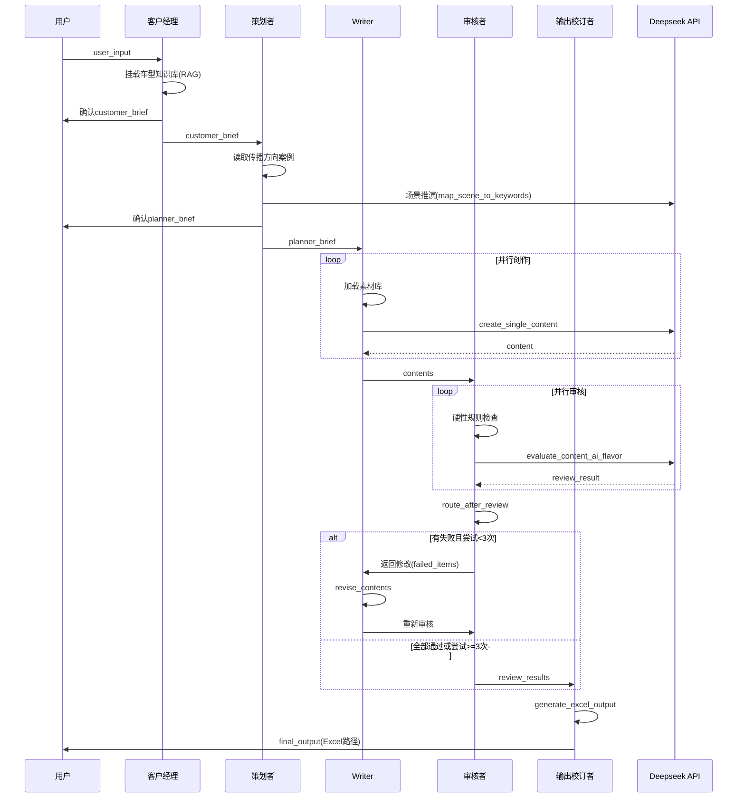
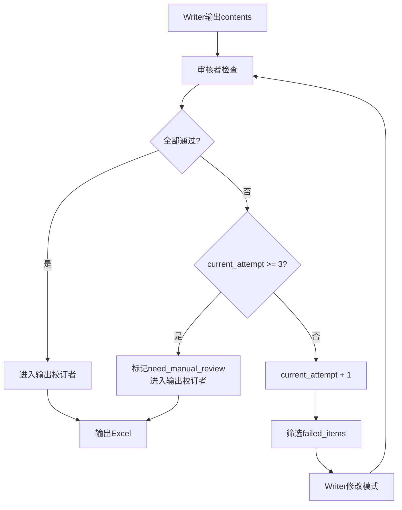
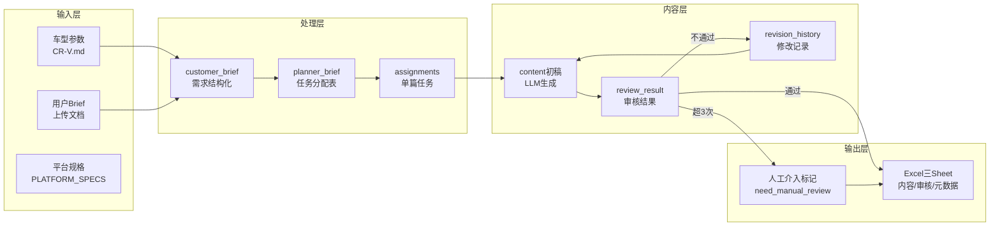

# 项目总览 - 汽车营销文案智能批量生成系统

**文档版本**: v1.0
**最后更新**: 2026-02-23
**文档状态**: 基于架构分析完成版

---

## 1. 项目目标

### 1.1 一句话定位

基于 **Agent Swarm 架构** 的汽车营销文案智能批量生成系统，通过5个协作Agent实现从需求理解到成品输出的全自动内容生产流水线。

### 1.2 核心价值主张

> **让AI像资深文案团队一样工作，而非简单的文本生成器**

- **效率提升**: 单次可批量生成3-10篇差异化内容
- **质量稳定**: 硬性规则卡点 + LLM智能审核双重保障
- **平台适配**: 自动适配抖音、小红书、今日头条等平台调性
- **去AI化**: 通过Anti-AI风格库和审核机制，消除机器生成痕迹

### 1.3 解决的问题清单

| 痛点类别 | 具体问题 | 系统解决方案 |
|---------|---------|-------------|
| **效率瓶颈** | 人工创作10篇文案需30min | 批量生成仅需3-5分钟 |
| **质量不稳定** | 不同写手风格差异大 | Agent标准化流程 + 硬性规则卡点 |
| **平台适配难** | 同一内容多平台需手动改写 | 平台规格自动适配（字数/风格/结构） |
| **AI痕迹重** | 生成内容套路化、八股文 | 反AI审核 + 真实爆款Few-Shot注入 |
| **参数堆砌** | 内容像说明书，缺乏场景感 | 场景切入库 + 细节描写库引导 |
| **竞品对比失当** | 容易拉踩友商或位置不当 | 硬性规则限制竞品名称出现位置 |

### 1.4 目标用户画像

| 用户角色 | 使用场景 | 核心需求 |
|---------|---------|---------|
| **车企市场部** | 新车上市Campaign、节点营销 | 快速产出大量差异化传播素材 |
| **广告代理公司** | 服务车企客户的日常内容产出 | 降低人力成本，提高交付效率 |
| **内容运营团队** | 多平台日常内容更新 | 保持内容质量和调性一致性 |
| **区域经销商** | 本地化内容定制 | 基于总部素材快速生成本地化版本 |

---

## 2. 架构分层

### 2.1 四层架构图



### 2.2 每层职责说明

| 层级 | 核心职责 | 关键文件 | 技术要点 |
|-----|---------|---------|---------|
| **表现层** | 用户交互、参数配置、结果展示 | `web_ui.py` | Streamlit、文件上传解析(PDF/DOCX/TXT) |
| **核心层** | Agent业务逻辑、流程编排、状态流转 | `swarm_with_llm.py` | LangGraph、TypedDict状态管理 |
| **接口层** | LLM API调用、重试机制、并发控制 | `config.py` | tenacity重试、asyncio并发、aiohttp |
| **数据层** | 素材存储、知识库管理、规则定义 | `01-输入材料/` `02-参考学习/` | Markdown、文件系统、单例缓存 |

### 2.3 层间依赖关系

```
表现层 ──依赖──> 核心层 ──依赖──> 接口层
                      │
                      └────依赖────> 数据层
```

**依赖原则**:
- 上层可以调用下层，禁止反向依赖
- 核心层通过 `config.py` 统一访问接口层和数据层
- 数据层完全独立，可被任意上层读取

---

## 3. 核心模块

### 3.1 五个Agent职责对照表

| Agent | 核心职责 | 输入 | 输出 | 关键算法/逻辑 | 依赖素材 |
|-------|---------|------|------|--------------|---------|
| **客户经理** | 需求消化、参数抽取、用户确认 | `user_input` | `customer_brief` | RAG挂载车型知识库 | 需求消化模板.md、{车型}.md |
| **策划者** | 传播方向规划、任务分配 | `customer_brief` | `planner_brief` | 动态场景推演(map_scene_to_keywords_async) | 传播方向案例库.md |
| **Writer** | 内容创作、修改迭代 | `planner_brief` | `contents` | asyncio并发创作、动态温度/Token控制 | 结构模板库、内容变量库 |
| **审核者** | 硬性规则检查、AI味评估 | `contents` | `review_results` | 规则引擎 + LLM评估(evaluate_content_ai_flavor_async) | 硬性规则清单.md |
| **输出校订者** | 最终校验、Excel组装 | `review_results` | `final_output` | Excel三Sheet组装(generate_excel_output) | Anti-AI-style特征库.md |

### 3.2 SharedContext状态字段完整说明

```python
class SharedContext(TypedDict):
    # ==================== 用户输入层 ====================
    user_input: Dict          # {车型, 平台, 数量, 方向, 原始需求文档}

    # ==================== 处理中间层 ====================
    customer_brief: Dict      # {车型, 平台, 数量, 方向, 侧重点, 目标用户,
                              #  核心卖点, 调性, 特殊要求, 车型专属打底知识}

    planner_brief: Dict       # {传播方向, 话题切入点, assignments[]}
                              # assignments: [{id, persona, selling_point, scene, style}]

    contents: List[Dict]      # [{id, content, persona, selling_point, attempt,
                              #   revision_history[]}]

    review_results: List[Dict] # [{id, passed, issues[], suggestions[],
                               #   quality_scores{scene, emotion}}]

    # ==================== 输出层 ====================
    final_output: str         # Excel文件路径

    # ==================== 控制层 ====================
    current_attempt: int      # 当前审核-修改循环次数（1-3）
    need_manual_review: List[int]  # 需要人工介入的内容ID列表
    skip_confirmations: bool  # 是否跳过所有确认（Web端默认True）

    # ==================== 元数据层 ====================
    metadata: Dict            # {start_time, current_stage, attempts}
```

### 3.3 状态流转图



### 3.4 素材库体系（6大类素材）

| 素材类别 | 位置路径 | 用途说明 | 关键文件 |
|---------|---------|---------|---------|
| **既定资料库** | `01-输入材料/既定资料/` | 车型参数、卖点、对标信息 | `CR-V.md`, `HRV.md`, `思域.md`, `英仕派.md` |
| **动态Brief** | `01-输入材料/动态Brief/` | 临时Campaign需求文档 | `{Campaign名称}.md` |
| **结构模板库** | `02-参考学习/03-Writer材料/结构模板库/` | 内容框架、传播方向 | `春节返乡-情感路线.md` |
| **内容变量库** | `02-参考学习/03-Writer材料/内容变量库/` | 创作素材、灵感来源 | `口吻样本库.md`, `场景切入库.md`, `细节描写库.md`, `人设角度库.md`, `爆款参考库.md` |
| **硬性规则库** | `02-参考学习/04-审核者材料/` | 审核卡点规则 | `硬性规则清单.md` |
| **Anti-AI库** | `02-参考学习/05-输出校订者材料/` | 去AI化特征参考 | `Anti-AI-style特征库.md` |

---

## 4. 关键流程

### 4.1 用户使用流程



### 4.2 Agent执行流程



### 4.3 审核-修改循环逻辑



**循环规则**:
- 最大尝试次数: 3次
- 首次创作: `current_attempt = 1`
- 每次循环: `current_attempt += 1`
- 超过3次: 标记为`need_manual_review`，不再修改直接输出

### 4.4 数据流转图



---

## 5. 绝对不能动的核心 ⭐

> ⚠️ **警告**: 以下内容是系统的核心约束，修改可能导致系统崩溃或业务逻辑错误

### 5.1 硬性约束（红线规则）

| 约束类别 | 具体规则 | 违反后果 | 代码位置 |
|---------|---------|---------|---------|
| **字数红线** | 抖音: 250-350字<br/>小红书: 150-300字<br/>今日头条: 600-800字<br/>朋友圈: 50-150字 | 审核不通过，触发修改循环 | `审核者()` 函数内 `platform_limits` |
| **禁用词** | "说实话", "但问题来了", "你看", "首先/其次", "不得不说" | 审核不通过 | `check_banned_words()` |
| **参数上限** | 单篇参数不超过2个 | 审核不通过，提示减少参数 | `count_params()` |
| **竞品位置** | 友商名称只允许在正文中间段落出现，禁止在标题/首句/文末标签 | 审核不通过，可能引发品牌风险 | `evaluate_content_ai_flavor_async()` Prompt |
| **能源类型** | 禁止出现"混动/燃油/电动" | 保持内容通用性 | `硬性规则清单.md` |
| **时间表达** | 禁止"刚买/开了X年/用了X个月" | 保持内容通用性 | `硬性规则清单.md` |

### 5.2 架构红线

| 红线项目 | 说明 | 风险 |
|---------|------|------|
| **SharedContext结构** | TypedDict定义的字段名和类型不可随意修改 | 状态流转失败，Agent间数据传递错误 |
| **Agent调用顺序** | 客户经理 → 策划者 → Writer → 审核者 → 输出校订者 | 顺序错误导致依赖数据缺失 |
| **审核-修改循环** | 最多3次，由`current_attempt`控制 | 无限循环或过早退出 |
| **单例缓存** | `Config._material_cache` 必须在Agent初始化时加载 | 高频IO阻塞，性能崩溃 |
| **并发控制** | Writer使用`asyncio.gather`并行创作 | 改为串行将严重影响性能 |

### 5.3 业务规则

| 规则 | 说明 | 约束代码 |
|-----|------|---------|
| **审核-修改最多3次** | `current_attempt`从1开始，>=3次后强制进入输出校订者 | `route_after_review()` |
| **参数要求** | 必须包含1-2个宏观卖点 + 2-3个具体物理参数 | Writer Prompt中 `[💎 核心要求]` 部分 |
| **痛点营销逻辑** | 必须包含【共鸣痛点 → 制造纠结 → 参数降维 → 价值升华】链路 | Writer Prompt中 `[🔴 极其严厉的文风与逻辑规则]` |
| **友商名称位置** | 只允许在正文探讨参数时出现，禁止在标题/首句/文末标签 | Writer Prompt + 审核者Prompt |
| **名字灵活** | 不要频繁正经喊出"本田CR-V"，可用"这台车"、"同级标杆" | Writer Prompt |

### 5.4 修改会导致系统崩溃的代码区域

```python
# ⚠️ 危险区域 1: SharedContext 定义
# 位置: swarm_with_llm.py 第28-58行
class SharedContext(TypedDict):
    # 修改字段名会导致整个状态流转失败
    user_input: Dict
    customer_brief: Dict
    # ...

# ⚠️ 危险区域 2: LangGraph 流程编排
# 位置: swarm_with_llm.py 第1272-1303行
def create_swarm():
    workflow.add_edge("客户经理", "策划者")
    workflow.add_edge("策划者", "Writer")
    # 修改顺序会破坏依赖关系

# ⚠️ 危险区域 3: 审核-修改循环路由
# 位置: swarm_with_llm.py 第1185-1214行
def route_after_review(state: SharedContext) -> str:
    if current_attempt >= 3:  # 这个阈值不能随意修改
        return "输出校订者"

# ⚠️ 危险区域 4: 平台规格配置
# 位置: config.py 第20-44行
PLATFORM_SPECS = {
    "抖音": {
        "word_count": "200-350字",  # 修改会影响审核逻辑
        "limits": (200, 350)  # 这个tuple结构必须保持
    }
}
```

---

## 6. 技术债务与风险

### 6.1 已知的4个Bug点

| Bug编号 | 问题描述 | 现状 | 修复状态 | 风险等级 |
|--------|---------|------|---------|---------|
| **Bug-1** | 配置与业务逻辑耦合 | API Key、路径常量硬编码在函数内 | 部分修复（已抽离到config.py） | 中 |
| **Bug-2** | 并发模式下的高频文件I/O | 同步文件读取在asyncio并发中可能阻塞 | 已修复（单例缓存实现） | 高 |
| **Bug-3** | API无异常保护断路器 | 缺少重试机制和并发信号量 | 部分修复（tenacity重试已添加，信号量未实现） | 高 |
| **Bug-4** | 场景推理未形成真正映射 | 用户输入场景直接拼接，未匹配内容变量库 | 未修复 | 中 |

### 6.2 详细说明与修复建议

#### Bug-1: 配置耦合（部分修复）

**问题**: 早期版本API Key和路径硬编码在`swarm_with_llm.py`各处

**当前状态**:
- ✅ 已抽离到 `config.py`
- ⚠️ 仍有部分路径硬编码（如 `02-参考学习/03-Writer材料/...`）

**修复建议**:
```python
# 建议: 在config.py中统一定义所有路径常量
CONTENT_LIBRARY_PATHS = {
    "persona_samples": "02-参考学习/03-Writer材料/内容变量库/口吻样本库.md",
    "scene_samples": "02-参考学习/03-Writer材料/内容变量库/场景切入库.md",
    # ...
}
```

**优先级**: P2（中）

#### Bug-2: IO阻塞（已修复）

**问题**: `asyncio.gather`并发时每个任务都触发文件读取

**修复方案**: 单例缓存模式
```python
# config.py 第56-73行
_material_cache = {}

@classmethod
def load_material(cls, file_path: str) -> str:
    if file_path in cls._material_cache:
        return cls._material_cache[file_path]
    # 读取并缓存...
```

**验证**: 69条细节样本加载时间从~500ms降至~5ms

**优先级**: P0（已修复）

#### Bug-3: API断路器（部分修复）

**问题**: 大量并发请求Deepseek API可能触发429错误

**当前状态**:
- ✅ 已添加tenacity重试（3次，指数退避）
- ❌ 未实现并发信号量控制

**修复建议**:
```python
# 添加信号量控制并发
_semaphore = asyncio.Semaphore(5)  # 最大5并发

async def call_deepseek_api_async(...):
    async with _semaphore:
        # 原有逻辑...
```

**优先级**: P1（高）

#### Bug-4: 场景伪动态（未修复）

**问题**: 用户输入"过年回家满载而归"直接拼接到Writer Prompt，未真正匹配内容变量库

**当前代码**:
```python
# 策划者() 第893行
"scene": f"[{direction}] - {enriched_scene_tags}",  # 只是字符串拼接
```

**修复建议**:
```python
# 实现真正的RAG匹配
def match_scene_to_library(user_scene: str) -> Dict:
    # 1. 用LLM提取用户场景的关键词向量
    # 2. 从场景切入库中匹配最相似的范式
    # 3. 返回结构化的场景要素
    pass
```

**优先级**: P2（中）

### 6.3 其他潜在风险

| 风险 | 描述 | 影响 | 缓解措施 |
|-----|------|------|---------|
| **API密钥泄露** | config.py中硬编码了API Key | 安全风险 | 使用环境变量，已部分实现 |
| **文件路径依赖** | 素材库使用相对路径 | 部署时可能失效 | 添加路径存在性检查 |
| **LLM输出不稳定** | JSON解析可能失败 | 审核流程异常 | 已添加try-catch默认放行 |
| **Excel依赖** | 依赖openpyxl库 | 环境兼容性问题 | 添加备用文本输出 |
| **内容同质化** | 相同参数多次生成相似内容 | 内容多样性不足 | 动态温度(0.6-0.9) + 随机素材抽样 |

### 6.4 修复建议优先级

```
P0 (立即修复):
  - [已完成] Bug-2: IO阻塞

P1 (高优先级):
  - Bug-3: 添加并发信号量控制
  - API密钥完全迁移到环境变量

P2 (中优先级):
  - Bug-1: 完全抽离所有路径常量
  - Bug-4: 实现真正的场景RAG匹配
  - 添加更多平台支持（朋友圈完整支持）

P3 (低优先级):
  - 添加更多车型资料
  - 扩充内容变量库
  - 优化UI交互体验
```

---

## 附录

### A. 项目文件结构

```
文案部/
├── 01-输入材料/           # 动态输入
│   ├── 动态Brief/
│   └── 既定资料/          # 车型知识库
├── 02-参考学习/           # Agent知识库
│   ├── 01-客户经理材料/
│   ├── 02-策划者材料/
│   ├── 03-Writer材料/     # 内容变量库
│   ├── 04-审核者材料/
│   └── 05-输出校订者材料/
├── 04-产出仓库/           # 生成结果输出
├── config.py              # 全局配置
├── swarm_with_llm.py      # 核心Agent实现
├── web_ui.py              # Streamlit界面
└── 项目总览.md            # 本文档
```

### B. 关键配置速查

| 配置项 | 默认值 | 说明 |
|-------|-------|------|
| `MAX_ATTEMPTS` | 3 | 审核-修改最大循环次数 |
| `RETRY_ATTEMPTS` | 3 | API调用重试次数 |
| `CONCURRENT_LIMIT` | 无限制 | 建议添加5-10并发限制 |
| `DYNAMIC_TEMP_RANGE` | 0.6-0.9 | Writer温度随机范围 |
| `DETAIL_SAMPLE_SIZE` | 3 | 每篇抽取细节样本数 |

### C. 版本历史

| 版本 | 日期 | 变更说明 |
|-----|------|---------|
| v1.0 | 2026-02-23 | 初始版本，基于架构分析完成 |

---

*文档结束*
